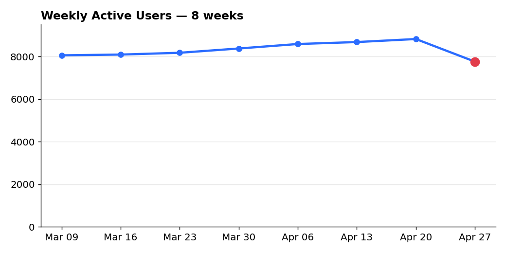
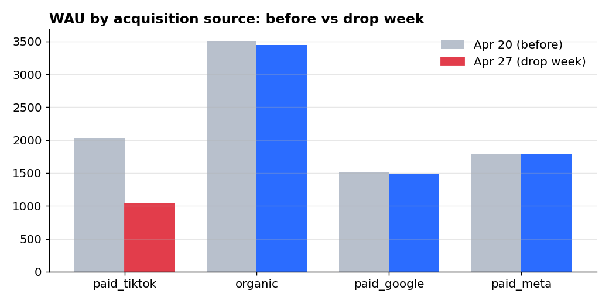
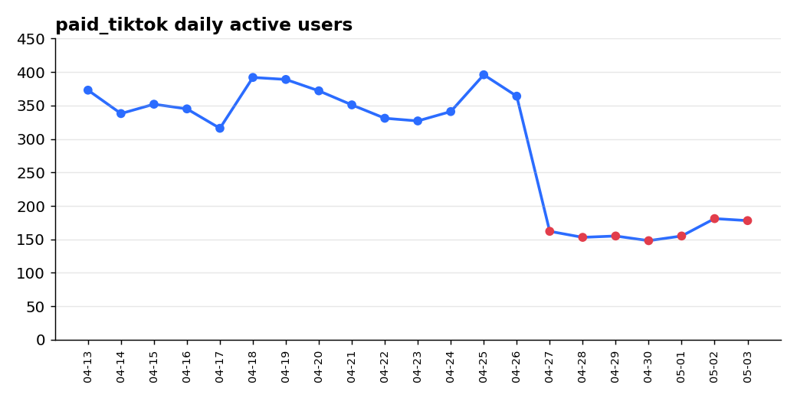

# Pad WAU-a u tjednu 27.04.2026.

WAU je pao 12% jer je paid_tiktok kampanja stala 27.04.
Uzrok je vanjski, nije problem proizvoda

## Situacija

Broj tjednih aktivnih korisnika pao je s 8821 na 7760 u tjednu 27.04., pad od 12%
u odnosu na prethodni tjedan. To prekida trend jer je WAU prethodnih 7 tjedana stalno rastao.

## Komplikacija

Nije problem proizvoda. Broj sesija po korisniku ostao je ravan (2.76 vs 2.73),
a pad se dogodio na svim platformama: Android 13.8%, iOS 10.7%, Web 8.8%.
Da je u pitanju bug u aplikaciji ili greška u trackingu, ne bi padao samo jedan kanal,
nego bi pale sve tri platforme bez obzira na izvor korisnika.

Cijeli pad dolazi iz jednog kanala: paid_tiktok je pao s 2029 na 1034 korisnika
(94% ukupnog pada). Organic, Google i Meta ostali su nepromijenjeni. Budući da TikTok
dovodi korisnike na sve platforme, gašenje tog kanala objašnjava pad na sve tri, a Android je pao najviše jer TikTok korisnici skewaju prema Androidu.

Po danima, TikTok nije padao postupno nego naglo: dnevni broj korisnika pao je
s ~360 na ~160 točno 27.04. i ostao na toj razini.

## Rješenje

TikTok kampanja je stala 27.04. Sljedeći koraci:

- Provjeriti status TikTok kampanje (pauzirana / potrošen budžet / nešto treće).
- Ako je namjerno ugašena, pad je očekivan i ne treba ništa mijenjati.
- Ako TikTok ostaje ugašen, budžet preusmjeriti na kanale koji su ostali stabilni.

**So what:** uzrok je vanjski kanal pa je rješenje brzo i ne treba razvojni tim.
**Now what:** provjeriti status TikTok kampanje danas i pratiti oporavak idući tjedan.

## Kako sam došao do zaključka

1. Potvrdio sam pad - usporedio WAU kroz svih 8 tjedana, zadnji tjedan -12%.
2. Provjerio sam je li problem u proizvodu - sesije po korisniku ravne, pad na svim platformama.
3. Segmentirao po izvoru korisnika - gotovo cijeli pad je paid_tiktok.
4. Pogledao TikTok po danima - nagli step-down točno 27.04. → kampanja je stala tog dana.
